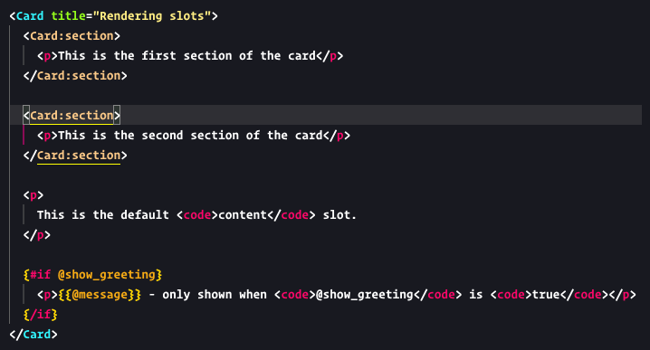

# vscode-orb

VSCode extension providing extensive support for the ORB template language.

## Example

## Features

This extension extends the HTML language mode with the following features:

1. Highlighting of all `ORB` language tokens:

- `component` tags
- `slot` tags
- `expression` attributes
- `named blocks`
- printing and control `expressions`
- private `comments`

2. Snippets for common `ORB` language constructs:

- `if` generates a `{#if ...} ... {/if}` block
- `for` generates a `{#for item in items} ... {/for}` block
- `c` generates a public comment `<!-- ... -->` block
- `pc` generates a private comment `{!-- ... --}` block
- `pe` generates a printing expression `{{ ... }}`
- `npe` generates a control expression `` block
- `slot` generates a `<Parent:slot>...</Parent:slot>` block

3. Registers itself as an `htmlLanguageParticipant` so all HTML LSP features are also available in `ORB` mode.

4. Registers itself as the default highlighter for `*.orb` files

5. Provides a new `orb.cycleTags` command to cycle through the different `ORB` tags

- Cycles through `{{ ... }}`, ``, `{!-- ... --}` tags
- Can be bound to a keybinding in the `keybindings.json` file
- Supports multi-line and selection
- Replaces `ERB` tags with `ORB` tags if there are any ERB tags surrounding the selection

## Installation

1. Install the `vsce` tool: `npm install -g @vscode/vsce`
2. Clone this repository
3. Change to the extension directory and run `vsce package`
4. Install the resulting `vscode-orb-VERSION.vsix` file from VSCode through `Command Palette` -> `Extensions: Install from VSIX`
5. Reload your VSCode
